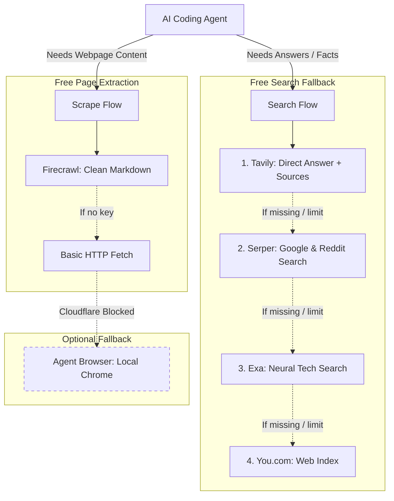

# bare-research

The bare minimum your AI agent needs to research the web for $0.

Built for the **Bare Stack** community. Instead of paying for expensive search APIs or bloated multi-agent setups, this gives your agent a simple, modular stack to search Google, pull direct answers, and scrape documentation.

---

## Free plans at a glance

Put the free stuff right on top. None of these need a credit card.

| Tool | Free allowance | Type | Best for |
| :--- | :--- | :--- | :--- |
| **Tavily** | 1,000 queries / month | Recurring | Instant direct answers and clean summaries in 1 shot |
| **Serper** | 2,500 queries | Signup grant | Raw Google index, official docs, Reddit lookups |
| **Firecrawl** | 500 to 1,000 credits / month | Recurring | Turning messy URLs into clean Markdown |
| **Exa** | $10 credit / month (~1,000 queries) | Recurring | Finding research papers, repos, and engineering blogs |
| **You.com** | $100 trial credit | Signup grant | Fast multi-source search index backup |
| **Agent Browser** | Unlimited | Local fallback | Cloudflare-protected pages (uses local RAM/CPU) |

**Starter combo:** Grab **Tavily** (for instant answers) and **Serper** (for Google and Reddit lookups). That covers 95% of agent tasks.

---

## Quick setup: .env

Create a `.env` or `.env.bare-research` file in your workspace or project folder. Paste whatever keys you have:

```env
TAVILY_API_KEY=
SERPER_API_KEY=
FIRECRAWL_API_KEY=
EXA_API_KEY=
YOU_API_KEY=
```

No comments needed here since the table above explains what each one does. Even having just one key is enough to get started.

---

## Install

Install directly into your agent (Hermes, Claude Code, Antigravity, OpenCode, Cline) using the `skills` CLI:

```bash
npx skills add https://github.com/paulablaza/bare-research --skill bare-research
```

Or clone it manually:
```bash
git clone https://github.com/paulablaza/bare-research.git
```

---

## How it works



---

## What "Bare" means

"Bare" is built for the Bare Stack community:
1. **Zero pip dependencies:** Pure Python standard library (`urllib`, `json`, `argparse`). Runs instantly on any machine or container.
2. **Modular combos:** You can build your own custom research skills on top of this. For example, use Serper with `site:reddit.com/r/LocalLLaMA` to build a Reddit research skill that finds threads and grabs the data without needing paid Reddit API keys. Or pair Firecrawl with your own doc crawler.
3. **Hands-off security:** Never auto-installs system packages behind your back and never spawns silent background browsers.

---

## Terminal usage

Search:
```bash
python research.py search "how to configure Hermes Agent Bot Mode"
```

Google / Reddit search:
```bash
python research.py search "site:reddit.com/r/LocalLLaMA DeepSeek R1" --provider serper
```

Scrape a URL to clean Markdown:
```bash
python research.py scrape "https://github.com/NousResearch/hermes-agent"
```

Optional browser inspection (for Cloudflare-protected pages):
```bash
python research.py scrape "https://protected-site.com" --provider browser
```

---

## Agent Browser note

Agent Browser is strictly an optional fallback for pages blocked by Cloudflare. Because running a local Chrome instance consumes RAM and CPU, the script never launches it automatically.

If you want browser fallback, install it manually or tell your agent:
```bash
npm install -g agent-browser
```

---

## How we can level this skill up

Here are practical ideas to expand this skill:
- **Zero-key fallback (DuckDuckGo / SearXNG):** Search the web out of the box even before adding an API key.
- **Local file cache (`.cache/research/`):** Cache search queries and page scrapes locally so agents do not burn query credits when asking about the same repo twice.
- **Multi-page doc crawler:** Given a docs link (e.g. `/docs/quickstart`), follow local child links and assemble a single clean Markdown reference for the agent.
- **Reddit JSON fetcher:** Direct `.json` endpoint parsing for Reddit threads found via Serper, bypassing browser scrapers entirely.
